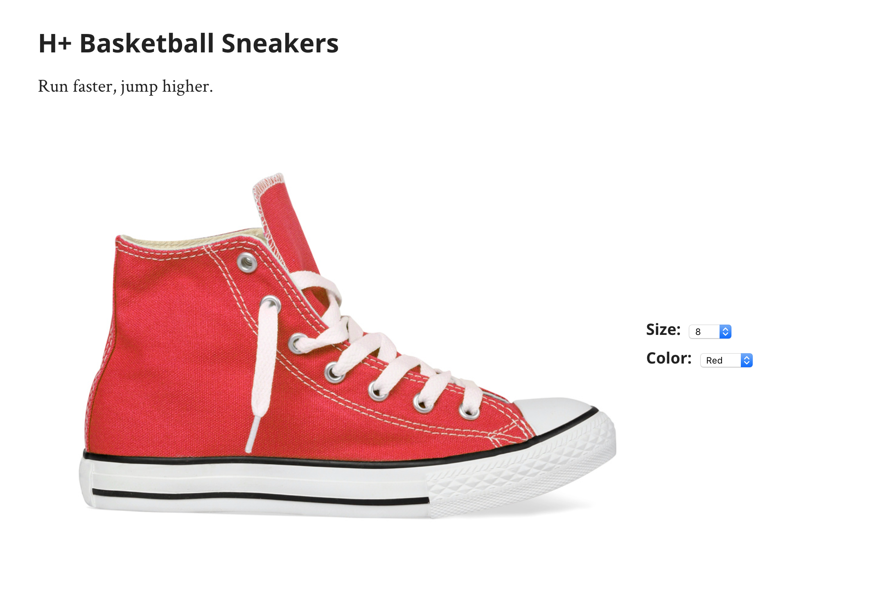

# SRP-React
Met deze SRP opdracht hoop ik mijn skills in programmeren weer naar een hoger niveau te brengen. Ik heb gemerkt dat veel bedrijven het prettig vinden om React.js te gebruiken in hun projecten. In de vacatures voor Front End developers zie je dit daarom ook vaak terugkomen.

Ik heb wel vaker gehoord over React.js, maar ik heb er nooit echt iets mee gedaan. Daarnaast heb ik ook nog nooit eerder met een framework gewerkt, dus vond ik dat het tijd werd om me hier toch in te gaan verdiepen. Dit wil ik doen door op Lynda.com een cursus te volgen. Bij het volgen van deze cursus hoop ik een beter beeld te krijgen wat React.js precies is en waarom bedrijven het zo prettig vinden.


# Wat is React?
React is een Javascript Library om User Interfaces mee te bouwen. React kun je toepassen in verschillende omgevingen. Hiervoor heb je **ReactDOM**, **ReactDOMServer** en **React Native**.

* **ReactDOM** voor React in de browser
* **ReactDOMServer** voor React op de server
* **React Native** voor het bouwen van Native apps

In deze cursus wordt de focus vooral gelegd op de browser, dus wordt **ReactDOM** gebruikt.

Je kunt ervoor kiezen om React te gebruiken in nieuwe projecten, maar je kunt het ook prima toepassen in bestaande projecten.


# React Installeren
Om React te installeren in een project kun je simpelweg de benodigde script tags in je HTML bestand toevoegen op deze volgorde.

```HTML
<script crossorigin src="https://unpkg.com/react@16/umd/react.development.js"></script>
<script crossorigin src="https://unpkg.com/react-dom@16/umd/react-dom.development.js"></script>
<script crossorigin src="https://unpkg.com/create-react-class@15/create-react-class.js"></script>
```
Daaronder voeg je nog een script tag toe met de verwijzing naar het Javascript bestand waar je de code in gaat typen.

```HTML
<script src="app.js"></script>
```

Vervolgens maak je in je HTML een ```div``` met een id aan op de plek waar jij wil dat React wordt toegepast.

```HTML
<div id="react-root"></div>
```

in je ```app.js``` maak je een IIFE (Immediately Invoked Function Expression) Waarin alle code komt.

```Javascript
(function() {
  "use strict";
  
  
})();

```
# Element aanmaken
Als eerst begin je met het maken van een element die je wil laten verschijnen op de pagina. Dit doe je met ```React.createElement()```. Deze functie neemt **3 argumenten:**

1. Type element
2. Attributen als Object
3. Wat er in het element komt tussen ```<div>``` en ```</div>```

Hieronder een voorbeeld:

```Javascript
var ProductCustomizer = React.createElement('div', {className: "customizer"}, "Product customizer will go here" )
```
_**LET OP:** Als je attributen meegeeft moeten deze de naam hebben zoals die in de DOM API staan. ```class``` is bijvoorbeeld iets wat je in html zou typen, maar in de DOM API is dit_ ```className```.
[https://reactjs.org/docs/dom-elements.html](https://reactjs.org/docs/dom-elements.html)


Onder deze functie voeg je de ```ReactDOM.render()``` functie toe. Deze functie neemt **2 argumenten:** 

1. Het element dat gerenderd moet worden.
2. De plek waar het gerenderd moet worden.

```Javascript
var ProductCustomizer = React.createElement(
	'div',
	{className: "customizer"},
	"Product customizer will go here"
)

ReactDOM.render( ProductCustomizer , document.getElementById("react-root"));

```

# Componenten
Componenten zijn de bouwstenen van een User Interface. De componenten bevatten elementen. Dit zijn de elementen die je in HTML gebruikt.

## Het bepalen van componenten:

Bij het opstellen van een webpagina met behulp van componenten is het belangrijk dat je eerst goed kijkt welke componenten er gebruikt moeten worden. Daarnaast moet je ook bepalen welke data er gebruikt wordt en in welk component deze data moet worden opgeslagen. Dit is belangrijk, omdat **data in React alleen maar doorgegeven kan worden van parent naar child** en niet andersom.

Hieronder een voorbeeld van een webpagina. Op het moment dat de gebruiker een andere kleur kiest, zal de afbeelding van de schoen veranderen, maar ook zullen alleen de beschikbare maten worden aangegeven in het dropdown menu voor de schoenmaat. 



Dit gedeelte van de webpagina zal onderverdeeld moeten worden in 3 componenten:

1. De afbeelding
2. De filters
3. Een parent


De data van de filter opties wordt dan opgeslagen in de parent genaamd ```<ProductCustomizer>``` en deze geeft de data dan door naar de children.


Op het moment dat de gebruiker een andere kleur kiest moet ```<ProductImage>``` hiervan op de hoogte zijn, zodat de kleur van de schoen veranderd kan worden. Ook moet ```<ProductFilters>``` hiervan op de hoogte zijn, zodat de juiste schoenmaten weergegeven kunnen worden.


## Component aanmaken:
Een component aanmaken doe je met behulp van **een functie of een class**. Functies zijn makkelijker om te maken, maar classes ondersteunen alle functies van React.

### Component als functie:
**Een component functie heeft altijd een parameter genaamd ```props```.** Daarnaast moet de naam van een component functie altijd met een **hoofdletter** beginnen. Zo weet React het verschil tussen componenten en elementen. Ook weet de browser extensie "React Developer Tools" het verschil tussen elementen en componenten. Dit is prettiger voor debugging.

```Javascript
function MyComponent(props){
	//code goes here...
}
```

Deze functie geeft een element terug. Dit doe je weer met ```return React.createElement(..., ..., ...)```

voorbeeld:

```Javascript
function MyComponent(props){
	return React.createElement(
		'div',
		{className: "customizer"},
		"Product customizer will go here"
	)
}
```

### Component als class:
Omdat er in deze cursus een javascript bestand ```create-react-class.js``` is geimplementeerd, is het mogelijk om je classes als volgt te schrijven:

```Javascript
var MyComponent = createReactClass({
	render: function{
		return React.createElement(
			'div',
			{className: "customizer"},
			"Product customizer will go here"
		)
	}
})
```

Je kunt componenten ook als ES6 class schrijven. Dit doe je op deze manier:

```Javascript
class MyComponent extends React.Component {

	render(){
		return React.createElement(
			'div',
			{className: "customizer"},
			"Product customizer will go here"
		)
	}
}
```

## Componenten in componenten
Om een element aan te maken in React gebruik je dus ```React.createElement()```. Binnen een element kun je ook children toevoegen. Dit doe je door als derde argument nog een ```React.createElement()``` functie mee te geven. 

```Javascript
function ProductCustomizer(props) {
	return.React.createElement(
		"div",
		{ className: "customizer" },
		React.createElement(
			"div",
			{ className: "product-image" },
			"image goes here"
		)
	);
}
```

Ook is het mogelijk om in een component een ander component toe te voegen. Hiervoor moet je eerst een ander component aanmaken. Vervolgens gebruik je ```React.createElement(NaamVanComponent)```. Dit zal er als volgt uitzien:


```Javascript
function ProductImage(props) {
	return React.createElement("img", {
		src: "../../../assets/red.jpg",
		alt: "Product image"
	});
}

function ProductCustomizer(props) {
	return.React.createElement(
		"div",
		{ className: "customizer" },
		React.createElement(
			"div",
			{ className: "product-image" },
			React.createElement(ProductImage)
		)
	);
}
```

De component```ProductCustomizer``` zal er volgens de virtual DOM van React als volgt uitzien.

```HTML
<ProductCustomizer>
	<div class="customizer">
		<div class="product-image">
			<ProductImage>
				
			</ProductImage>
		</div>
	</div>
</ProductCustomizer>
```


# JSX, ES6 & Babel
Om binnen een element nog een element aan te maken, zul je dus opnieuw de functie ```React.createElement()``` moeten aanroepen. Dat is nogal veel werk en het kan snel onoverzichtelijk worden. 

Gelukkig is er JSX! Dit is een extensie van Javascript die het mogelijk maakt om **HTML code te gebruiken in Javascript.** Hierdoor hoef je ```React.createElement()``` niet steeds opnieuw aan te roepen. JSX wordt alleen niet ondersteund door browsers, dus zal deze code omgeschreven moeten worden naar iets dat de browser wel begrijpt. Dit doet Babel voor je. Babel is een transpiler die ervoor zorgt dat de code weer wordt omgeschreven in iets wat de browser begrijpt. JSX wordt dus weer gewoon Javascript. Babel werkt ook voor ES6.

ES6 verwijst naar een nieuwere versie van Javascript. Deze versie heeft een uitgebreidere syntax en zorgt dus voor meer mogelijkheden. Zo kun je bijvoorbeeld nu gemakkelijk classes aanmaken, wat handig is, omdat React hier ook gebruik van maakt.

Om Babel te gebruiken, kun je een programma zoals Prepros of Codekit gebruiken. In dit programma kun je dan aangeven welke transpiler je wil gebruiken voor een bepaald Javascript bestand. De code wordt dan omgeschreven zodra er een wijziging is gemaakt in het bestand. De omgeschreven code komt dan in een ander bestand. in dit geval komt de code in ```app-min.js```. Het is daarom ook belangrijk dat je naar dit bestand verwijst in je HTML.

```
<script src="app-min.js"></script>
```


Als je gebruik maakt van Babel hoef je geen ```React.createElement``` meer te gebruiken. Je kunt nu simpelweg een functie schrijven die HTML code teruggeeft. Deze HTML code moet wel tussen ```()``` haakjes staan. Daarnaast kun je maar 1 element teruggeven. Dit element mag wel children hebben.


voorbeeld:

```JSX
function MyComponent(props){
	return (
		<div className="peopleList">
			<ul>
				<li>Tony Hawk</li>
				<li>Michael Jackson</li>
				<li>Will Smith</li>
			</ul>
		</div>
	)
}
```

Als je toch meerdere elementen wilt toevoegen die geen children van elkaar zijn, kun je dit op verschillende manieren oplossen. Je kunt net zoals in HTML de elementen samenvoegen in een ```<div>```. Ook kun je **```<React.Fragment>```** gebruiken. Dit gebruik je precies op dezelfde manier als een ```<div>``` tag, maar alleen wordt deze tag niet gerenderd.

```JSX
function MyComponent(props){
	return (
		<React.Fragment>
			<div>Child 1</div>
			<div>Child 2</div>
			<div>Child 3</div>
		</React.Fragment>
	)
}
```

## Verwijzen naar componenten in JSX

Verwijzen naar een component kun je in JSX ook heel makkelijk doen. Dit doe je door de naam van de component als "HTML" tag te typen. Dit ziet er als volgt uit:

```JSX
function MyComponent(){
	return(
		<div>
			<MyOtherComponent />
		</div>
	)
}

```


# Elementen renderen aan de hand van data in een array


Op de webpagina van de schoenenwinkel staan twee dropdowns. Eentje voor de schoenmaten en de andere voor de kleur van de schoen. Het kan zijn de data hiervan afkomstig is uit een API. Hierdoor zullen in de dropdowns alleen de beschikbare schoenmaten en kleuren weergegeven worden. In deze cursus is er geen gebruik gemaakt van een API, maar dit is wel nagebootst door de data op te slaan in ```window.Inventory```.

Om een lijst met de beschikbare schoenmaten te maken wil je iets hebben dat er als volgt uitziet:

``` HTML
<div class="field-group">
	<label for="size-options">Size:</label>
	<select name="sizeOptions" id="size-options">
		<option>7</option>
		<option>7.5</option>
		<option>8</option>
		<option>8.5</option>
		<option>9</option>
		<option>9.5</option>
		<option>10</option>
		<option>10.5</option>
		<option>11</option>
		<option>11.5</option>
		<option>12</option>
		<option>12.5</option>
	</select>
</div>
```

Dit kun je in React doen door een nieuw **component als functie** aan te maken waarbij de HTML teruggegeven wordt:

```JSX
function SizeSelector(props){
	return (
		<div className="field-group">
			<label htmlFor="size-options">Size:</label>
			<select name="sizeOptions" id="size-options">
				<option>7</option>
				<option>7.5</option>
				<option>8</option>
				<option>8.5</option>
				<option>9</option>
				<option>9.5</option>
				<option>10</option>
				<option>10.5</option>
				<option>11</option>
				<option>11.5</option>
				<option>12</option>
				<option>12.5</option>
			</select>
		</div>
	)
}
```

De ```<option>``` tags kunnen vervolgens allemaal weggelaten worden aangezien deze tags worden bepaald aan de hand van de data in ```window.Inventory```. Dit kun je doen door middel van een helper functie. Deze functie maak je aan binnen het component.

Aangezien alle schoenmaten netjes in een array zitten, kunnen deze worden gegenereerd met behulp van de ```map()``` functie. Deze functie neemt als argument een functie waarin verteld wordt wat er met elk item in de array moet gebeuren. Deze functie bevat ook een parameter waarvan je zelf de naam kunt bepalen. Deze parameter verwijst naar elk item van de array. In dit voorbeeld is elk item in de array een nummer, dus wordt er als parameter ```num``` gebruikt.

```Javascript
window.Inventory.allSizes.map(function(num){
	//Wat er moet gebeuren met elk item
});
```

Voor elk item in de array moet er een ```<option>``` element worden aangemaakt met daar in het nummer uit de array. Dit doe je als volgt:

```JSX
window.Inventory.allSizes.map(function(num){
	return(
		<option value={num} key={num}>{num}</option>
	)
});
```
**LET OP:** 

1. _Javascript Expressions in JSX worden tussen curly brackets ```{}``` gestopt. Dit geldt dus ook voor het verwijzen naar variabelen etc._

2. _Als je in React met item lists werkt, is het belangrijk dat je naast de attribuut (in dit geval ```value```) ook een ```key``` attribuut meegeeft. Met de ```key``` attribuut houdt React bij welke elementen er zijn aangemaakt en kan vervolgens uitvogelen welke er geupdate moeten worden op het moment dat een component opnieuw gerenderd wordt._

3. _**De hierboven genoemde attributen heten eigenlijk geen attributen, maar props.**_


De ```SizeSelector``` component ziet er in JSX dan als volgt uit:


```JSX
function SizeSelector(props){
	
	//Helper function
	function sizeOptions(){
		window.Inventory.allSizes.map(function(num){
			return(
				<option value={num} key={num}>{num}</option>
			)
		});
	}

	return (
		<div className="field-group">
			<label htmlFor="size-options">Size:</label>
			<select name="sizeOptions" id="size-options">
				
				{sizeOptions()} //Helper function gets called
				
			</select>
		</div>
	)
}
```

# Data doorgeven van component naar component
Zoals eerder aangegeven kan data in React alleen maar van parent naar child worden doorgegeven en niet andersom. Daarom moest er van te voren goed gekeken worden naar de webpagina, zodat er bepaald kon worden welke componenten er nodig zijn en in welk component de  benodigde data zich zal bevinden.

De componenten van de schoenenwinkel webpagina zijn zodanig opgebouwd dat alle er een parent component is met daarin children, zoals de ```<ProductImage>``` component. De benodigde data zal dus in de parent component ```<ProductCustomizer>``` worden opgeslagen en van hieruit naar de children worden doorgegeven.


## Props
**Het doorgeven van data tussen componenten** doe je met props. Props kunnen van alles zijn. Denk bijvoorbeeld aan nummers, arrays, objecten, functies, strings, etc. Je kunt het ook wel zien als variabelen. Het meegeven van props aan een component in JSX ziet er net zo uit als het meegeven van attributen aan elementen in HTML. Je kunt deze props dan zelf namen geven.

```JSX
function ProductCustomizer(props) {
    return (
      <div className="customizer">
        <div className="product-image">
          <ProductImage color="red" />  {/* <-- Een prop wordt hier meegegeven */}
        </div>
        <div className="selectors">
          <SizeSelector size={8}/> {/* <-- Een prop wordt hier meegegeven */}
        </div>
      </div>
    );
  }
```
**LET OP:**

1. _Bij het meegeven van een string als prop gebruik je ```""```_
2. _Bij het meegeven van functies, nummers, en alles wat een Javascript Expression is, gebruik je curly brackets ```{}```_


In het voorbeeld hierboven wordt de prop ```color``` meegegeven aan de component ```ProductImage``` en de prop ```size``` wordt meegegeven aan de component ```SizeSelector```. Om de prop ```size``` te gebruiken in ```SizeSelector``` kun je binnen dit component ```props.size``` gebruiken. Dit is ook de reden dat elk component dat geschreven is als functie een parameter ```props``` heeft.

Hieronder wordt de ```props.size``` gebruikt om een ```defaultValue``` mee te geven aan het ```<select>``` element.


```JSX
function SizeSelector(props){
	
	//Helper function
	function sizeOptions(){
		...
	}

	return (
		<div className="field-group">
			<label htmlFor="size-options">Size:</label>
			<select defaultValue={props.size} name="sizeOptions" id="size-options">
				{sizeOptions()} {/*Helper function gets called*/}
			</select>
		</div>
	)
}
```

# State
Aan een component kun je ook een state meegeven. Dit kan in het voorbeeld van de schoenenwinkel webpagina een kleur zijn die is gekozen door de gebruiker. Je kunt dan een state ```color``` meegeven waar React vervolgens iets mee doet. In dit geval de kleur van de schoen veranderen. **Om hier gebruik van te kunnen maken MOET je component niet geschreven zijn als functie, maar als class.** Het omschrijven van de ```ProductCustomizer``` component met behulp van ```create-react-class.js``` doe je als volgt:

```JSX
var ProductCustomizer = createReactClass({
	render: function(){
		return (
			<div className="customizer">
				<div className="product-image">
					<ProductImage color="red" />
				</div>
				<div className="selectors">
					<SizeSelector size={8} />
				</div>
			</div>
		)
	}
})
```
Omdat er een state gebruikt zal worden, moet deze ook toegevoegd worden aan de class. in CreateReactClass doe je dit met ```getInitialState```

```JSX
var ProductCustomizer = createReactClass({
	getInitialState: function(){
		return {
			color: "",
			size: 8,
			sizes: window.Inventory.allSizes;
		}
	},

	render: function(){
		return (
			<div className="customizer">
				<div className="product-image">
					<ProductImage color={this.state.color} /> {/*verwijzing naar state*/}
				</div>
				<div className="selectors">
					<SizeSelector size={this.state.size} sizes={this.states.sizes} /> {/*verwijzing naar state*/}
				</div>
			</div>
		)
	}
})
```

In ```getInitialState``` zitten de states ```color```, ```size``` en ```sizes```. Het verwijzen naar een state in de render functie doe je met ```this.state.naamVanState```. Deze states kun je ook terug zien in de React Developer Tools. Deze states kun je ook hier veranderen om te kijken wat er met het component gebeurd zodra hij opnieuw rendert. Erg handig voor debugging!


## State veranderen in code
De state kun je ook veranderen in de code. Dit is immers nodig om een applicatie te kunnen bouwen. Om in de schoenenwinkel website de state ```size```te vervangen, moet er eerst gekeken worden welke schoenmaat de gebruiker heeft gekozen. Hiervoor moet er dus een event listener gebruikt worden. Je wil weten of de gekozen schoenmaat is veranderd door de gebruiker, dus voeg je een ```onChange event``` listener toe aan het ```<select>``` element:

```JSX
<select defaultValue={props.size} name="sizeOptions" id="size-options" onChange={onSizeChange}>
```

Hierin verwijst ```{onSizeChange}``` naar een functie die nog geschreven moet worden. In deze functie komt de code die verteld wat er moet gebeuren op het moment dat de gebruiker een andere schoenmaat kiest. Deze functie wordt binnen de component ```SizeSelector``` geschreven.

```Javascript
function onSizeChange(evt){
	//verander state
}
```

Hier loop je tegen een klein probleempje aan. Je kunt de state namelijk niet direct vanuit deze functie veranderen. De state zit namelijk in de parent en er kan geen data van een child naar een parent worden doorgegeven, dus kan de state niet veranderd worden vanuit dit component. Om dit op te lossen kun je een functie schrijven in de parent waar de state zich bevindt, in dit geval ```ProductCustomizer```. Deze functie geef je mee als prop naar de child, in dit geval ```SizeSelector```. Vervolgens roep je in de functie ```onSizeChange``` deze prop aan.

**ProductCustomizer:**

```JSX
var ProductCustomizer = createReactClass({
    getInitialState: function() {
      var sizes = window.Inventory.allSizes,
        colors = window.Inventory.allColors;

      return {
        color: "red",
        colors: colors,
        size: 8,
        sizes: sizes
      };
    },
    
   	// functie die de state veranderd
    handleSizeChange: function(selectedSize){
    	
    	this.setState({
    		size: selectedSize,
    	})
    }

    render: function() {
      return (
        <div className="customizer">
          <div className="product-image">
            <ProductImage color={this.state.color} />
          </div>
          <div className="selectors">
            <SizeSelector size={this.state.size} sizes={this.state.sizes} handleSizeChange={this.handleSizeChange} /> {/* de functie handleSizeChange wordt als prop meegegeven aan SizeSelector component*/}
            <ColorSelector color={this.state.color} colors={this.state.colors} />
          </div>
        </div>
      );
    }
  });
```
**SizeSelector:**

```JSX
function SizeSelector(props) {
    function sizeOptions() {
      return props.sizes.map(function(num) {
        return (
          <option value={num} key={num}>
            {num}
          </option>
        );
      });
    }
    
    function onSizeChange(evt){
    	props.handleSizeChange(evt.target.value) //functie wordt aangeroepen vanuit props en de geselecteerde waarde voor de schoenmaat wordt als nummer meegegeven als argument.
    }

    return (
      <div className="field-group">
        <label htmlFor="size-options">Size:</label>
        <select defaultValue={props.size} name="sizeOptions" id="size-options" onChange={onSizeChange} value"">
          {sizeOptions()}
        </select>
      </div>
    );
  }
```

De state verander je niet direct door in de ProductCustomizer ```this.state = ...``` te gebruiken. Hier heeft React een functie voor. Binnen de het component ProductCustomizer, dat als class is geschreven, kun je ```this.setState()``` gebruiken. Deze functie neemt als argument een object waarin alle veranderingen komen. Het veranderen van de state voor de schoenmaat ziet er dan als volgt uit:

```Javascript
	this.setState({
		size: 8
	})
```

De ```setState()``` functie is een asynchrone functie. Daardoor kan het zijn dat de state nog niet is veranderd op het moment dat je een andere functie wil uitvoeren. Gelukkig neemt ```setState()``` ook een tweede argument aan. Dit tweede argument is een callback functie die wordt uitgevoerd op het moment dat de state daadwerkelijk is bijgewerkt.

# Nawoord

Door deze cursus te volgen heb ik vrij veel geleerd!
Naast het kennismaken met React, heb ik ook gelijk een beetje kennis gemaakt met Javascript ES6 en JSX. Ik heb hiervoor nog nooit met ES6 gewerkt en dat is voor React ook niet verplicht, maar als ik de cursus die ik heb gevolgd mag geloven maakt veel van de React documentatie die online staat gebruik van ES6. Het is daarom wel handig om hier het een en ander van te weten. 

Daarnaast heb ik ook geleerd om een transpiler als Babel te gebruiken. Om dit gemakkelijk te doen heb ik gebruik gemaakt van codekit. Ik had dit programma al een tijdje geleden gekocht, maar nooit echt gebruikt. Voor het werken met React lijkt het me wel erg prettig om te gebruiken!

Op dit moment begrijp ik voor een deel waarom zoveel bedrijven graag werken met React. Het is namelijk erg handig om te werken met componenten. De componenten kunnen bijvoorbeeld hergebruikt worden wat voor grote websites handig kan zijn. Daarnaast vind ik het ook handig dat React gebruik maakt van states. Voorheen maakte ik dit soort variabelen zelf aan, maar niet op zo'n gestructureerde manier als React dat doet. Verder vind ik het ook fijn om "HTML" te kunnen typen in combinatie Javascript. 

Ik ben erg blij dat ik deze cursus heb gevolgd op Lynda.com over het werken met React. De uitleg was vrij simpel en ik kon alles redelijk goed volgen. In het begin vond ik het nog vrij ingewikkeld om met React te werken, maar dit kwam vooral omdat React nog nieuw voor mij was. Het werken met event listeners die de state moeten veranderen in een parent component vond ik het lastigst, maar gelukkig begrijp ik dit nu wel. Na een paar keer nauwkeurig naar de code te kijken, kon ik toch achterhalen wat er precies gebeurde.

Ik denk dat ik nog veel kan leren over React door deze library bijvoorbeeld toe te passen in mijn eigen projecten. Dit is dan ook iets wat ik met veel plezier zou doen!


